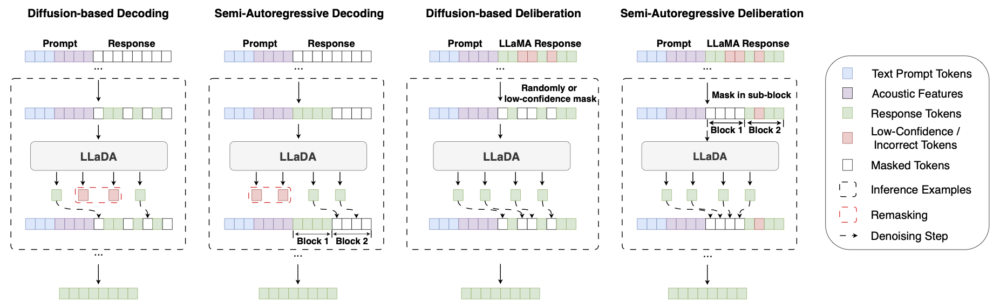

# Audio-Conditioned Diffusion LLMs for ASR and Deliberation Processing

<div align="center">

<div>
    <a href="https://arxiv.org/abs/2509.16622" target="_blank">
      
    </a>
    <a href="https://github.com/liuzhan22/Diffusion-ASR" target="_blank">
      
    </a>
    <a href="https://drive.google.com/file/d/1btAsCXTHQApnRcl_k5Wfn0zSD08yXHZh/view?usp=sharing" target="_blank">
      
    </a>
    
</div>

</div>

---

## 📖 Abstract

We present an empirical study on utilizing the diffusion-based large language model **LLaDA** for automatic speech recognition (ASR). We propose **Whisper-LLaDA**, integrating the Whisper encoder with LLaDA to evaluate diffusion-based LLMs both as external deliberation modules for autoregressive transcripts and as standalone internal decoders.

By leveraging the bidirectional attention and denoising capabilities of LLaDA, we systematically investigate various masking and decoding strategies, demonstrating the viability and current limitations of non-autoregressive diffusion paradigms in ASR.

**Key Capabilities:**
1.  **Direct Decoding:** Whisper-LLaDA supports diffusion-based and semi-autoregressive decoding conditioned on the speech features, with most experimental configurations achieving faster inference speeds than the autoregressive baseline.
2.  **Deliberation Processing:** Whisper-LLaDA refines preliminary transcripts generated by an external speech recognizer. It leverages LLaDA's bidirectional attention mechanism through diffusion-based remasking (random or low-confidence) and semi-autoregressive remasking.
3.  **Performance:** On LibriSpeech, the best cascade system achieves 2.25%/4.94% WER on test-clean/test-other, representing a 12.3% relative improvement over the Whisper-LLaMA baseline on the test-other split.

<div align="center">
  
  <br>
  <em>Overview of decoding and deliberation-based processing strategies.</em>
</div>

---

## 🛠️ Installation

**1. Create and activate the conda environment:**
```bash
conda env create -f environment.yaml
conda activate whisper-llada
```

**2. Install k2:**
```bash
pip install k2==1.24.4.dev20250714+cuda12.6.torch2.7.1 -f https://k2-fsa.github.io/k2/installation/pre-compiled-cuda-wheels-linux/2.7.1.html
```

**3. Download Model Checkpoints:**
Download [whisper-large-v3](https://huggingface.co/openai/whisper-large-v3) and [LLaDA-8B-Instruct](https://huggingface.co/GSAI-ML/LLaDA-8B-Instruct).

---

## 🚀 Quick Start

### Training
1. **Data Preparation:** Organize your training data to match the format in `data/train_example_data.json`.
2. **Configuration:** Modify the parameters in `configs/config.yaml`.
3. **Start Training:** Launch the training using `torchrun`.

```bash
# Launch training on 1 node with 8 GPUs
torchrun --nnodes=1 --nproc_per_node=8 train.py --config configs/config.yaml
```

### Inference
Download the checkpoint from [Google Drive](https://drive.google.com/file/d/1btAsCXTHQApnRcl_k5Wfn0zSD08yXHZh/view?usp=sharing).

```bash
python3 inference.py --config configs/decode_config.yaml
```
You can switch between different decoding and deliberation strategies by modifying the **decode** section in `configs/decode_config.yaml`:

 - Diffusion-based Decoding: Set `mode: "decoding"` and ensure `block_length` is equal to `gen_len` (e.g., 128).

 - Semi-Autoregressive Decoding: Set `mode: "decoding"` and set `block_length` to an integer fraction of `gen_len` (e.g., 64 or 32).

 - Diffusion-based Deliberation: Set `mode: "diffusion_deliberation"`. You also need to specify the `mask_ratio` (e.g., 0.3) and `masking_type` (options: "random" or "low_confidence").

 - Semi-Autoregressive Deliberation: Set `mode: "semi_ar_deliberation"`. You can adjust the number of sub-blocks by modifying the `num_chunks` parameter (e.g., 4).

---

## 📝 Citation

If you find our paper useful for your research, please consider citing our paper:

```bibtex
@inproceedings{wang2025audio,
    title={Audio-Conditioned Diffusion LLMs for ASR and Deliberation Processing},
    author={Wang, Mengqi and Liu, Zhan and Jin, Zengrui and Sun, Guangzhi and Zhang, Chao and Woodland, Philip C},
    booktitle={Proc. ICASSP},
    year={2026}
}
```

---
*License: Apache 2.0*